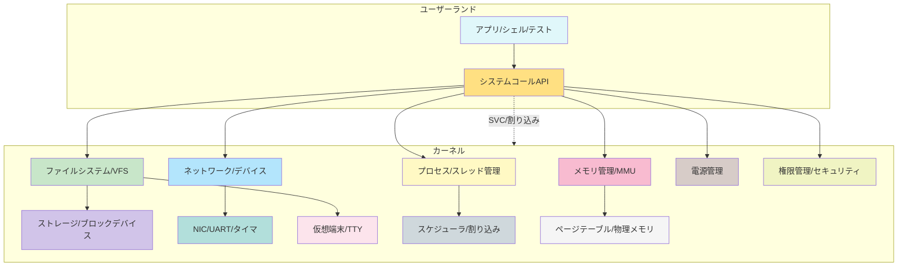

# ARM/64 OS サブシステム連携フロー図（2025/12/27）

```mermaid
graph TD
  subgraph ユーザーランド
    A[アプリ/シェル/テスト] --> B[システムコールAPI]
  end
  subgraph カーネル
    B --> C[プロセス/スレッド管理]
    B --> D[ファイルシステム/VFS]
    B --> E[ネットワーク/デバイス]
    B --> F[メモリ管理/MMU]
    B --> G[電源管理]
    B --> H[権限管理/セキュリティ]
    D --> I[ストレージ/ブロックデバイス]
    E --> J[NIC/UART/タイマ]
    D --> K[仮想端末/TTY]
    C --> L[スケジューラ/割り込み]
    F --> M[ページテーブル/物理メモリ]
  end
  B -.-> |SVC/割り込み| カーネル
  style A fill:#e0f7fa
  style B fill:#ffe082
  style C fill:#fff9c4
  style D fill:#c8e6c9
  style E fill:#b3e5fc
  style F fill:#f8bbd0
  style G fill:#d7ccc8
  style H fill:#f0f4c3
  style I fill:#d1c4e9
  style J fill:#b2dfdb
  style K fill:#fce4ec
  style L fill:#cfd8dc
  style M fill:#f5f5f5
```

---

- ユーザーランド→システムコールAPI経由で各カーネルサブシステムにアクセス
- サブシステム間の依存・呼び出し関係を可視化
- 今後の拡張や設計議論のベースに
