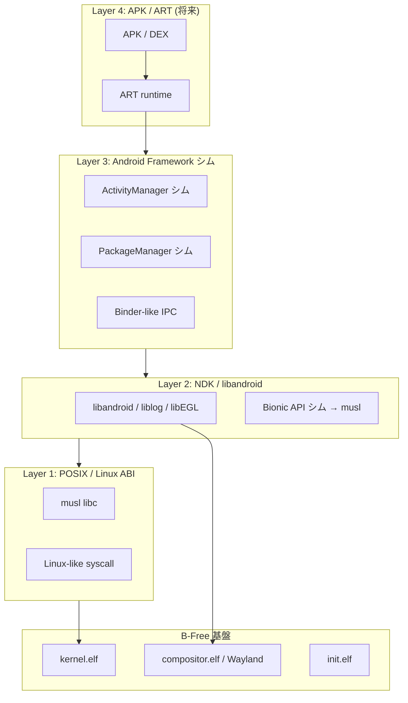
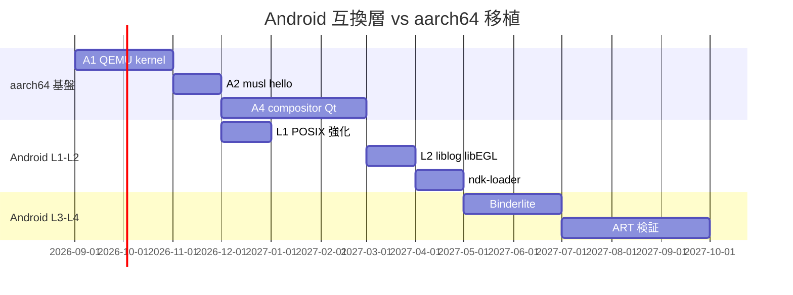

# B-Free Android 互換層 設計書

更新: 2026-08-13  
対象ツリー: `bfree_aarch64/`（`C:\Users\h_kis\Desktop\B-Free-master\Program\bfree_aarch64`）  
前提 OS: B-Free compositor-first（musl + Wayland + Qt6 desktop）

---

## 1. 目的とスコープ

### 1.1 目的

B-Free OS（aarch64）上で **Android アプリエコシステムの一部** を利用可能にし、  
「Linux 系 OS + モバイル API」のハイブリッド互換環境を提供する。

### 1.2 スコープ（やること / やらないこと）

| 区分 | 内容 |
|------|------|
| **In scope** | POSIX/Linux 互換の強化、Android NDK ネイティブ API の部分実装、Wayland へのグラフィック橋渡し、ログ・入力・ストレージの Android 風 API |
| **Partial** | Java/Kotlin APK（ART 導入後の限定 APK）、Intent 風 IPC の簡易版 |
| **Out of scope** | Google Play サービス / GMS、SafetyNet / Play Integrity、完全 AOSP 互換、バイナリ互換の全 APK |

### 1.3 非目標（明示）

- Android 13/14 との **100% API 互換** は目標にしない
- 既存 APK を **改変なしで全件動作** させることは保証しない
- Bionic バイナリの **直接実行**（dlopen 互換）は Phase 2 以降の検討事項

---

## 2. B-Free 現状アーキテクチャとの関係

### 2.1 x86_64 本線（参照）

```
GRUB → kernel.elf
         → compositor.elf (PID1, Wayland server, FB scanout)
         → init.elf → desktop.elf (Qt6 -platform wayland)
         → busybox.elf
```

- libc: **musl**（`x86_64-elf` クロス）
- syscall: Linux 風番号 + B-Free 拡張（`bfree_guest_abi.h`）
- GUI: **Wayland**（wl_shm / compositor が唯一の scanout）

### 2.2 aarch64 目標（同一コンセプト）

```
UEFI/QEMU virt → kernel.elf (aarch64)
                  → compositor.elf
                  → init.elf → desktop.elf
                  → [NEW] android_compat/ ユーザーランドサービス群
                  → [NEW] bfree-apkd（将来）または ndk-loader
```

Android 互換層は **カーネル内に入れない**。ユーザーランドのライブラリ + デーモン + compositor 拡張として載せる。

---

## 3. 互換モデル（4 層）



| Layer | 名称 | 優先度 | 概要 |
|-------|------|--------|------|
| **L1** | POSIX/Linux | P0 | musl + システムコール拡張（mmap, futex, poll, …） |
| **L2** | NDK ネイティブ | P1 | `liblog`, `libandroid`, `libEGL`→Wayland, `libOpenSLES` 最小 |
| **L3** | Framework シム | P2 | Binder 風 IPC、パッケージメタデータ、簡易 Activity ライフサイクル |
| **L4** | ART / APK | P3 | DEX 実行。対象 APK をホワイトリスト |

---

## 4. コンポーネント設計

### 4.1 ディレクトリ構成（計画）

```
bfree_aarch64/
├── android_compat/
│   ├── bionic_shim/          # Bionic → musl 薄いラッパ
│   │   ├── include/            # android/log.h, cutils/ 等の互換ヘッダ
│   │   └── src/
│   ├── ndk/
│   │   ├── liblog/             # __android_log_print → bfree-logd
│   │   ├── libandroid/         # ANativeWindow → Wayland surface
│   │   └── libEGL/             # EGL → compositor/Wayland EGL platform
│   ├── framework/
│   │   ├── binderlite/         # 簡易 Binder（Unix socket + 直列化）
│   │   ├── servicemanager/     # サービス登録（将来）
│   │   └── packagemanager/     # APK メタ読み取り（Phase 3）
│   ├── runtime/                # ART 代替検討（Phase 4）
│   └── tools/
│       └── ndk-loader/         # ネイティブ .so 単体ローダ（Phase 2）
├── userland/
│   └── bfree-logd/             # logcat 風デーモン
└── docs/
    └── ANDROID_COMPAT_LAYER.ja.md  # 本書
```

### 4.2 Bionic シム vs musl 直結

**方針: musl を正とし、Bionic は互換ヘッダ + 薄い shim ライブラリ**

| Bionic 機能 | B-Free 実装 |
|-------------|-------------|
| `malloc/free` | musl そのまま |
| `pthread_*` | musl（`pthread` サポートをカーネル側で拡張） |
| `property_get/set` | `bfree-propd` デーモン + 設定ファイル `/etc/bfree.prop` |
| `__android_log_*` | `bfree-logd` へ Unix ドメインソケット |
| `ashmem` | `BFREE_SYS_SHM_OPEN` + memfd 風 syscall 拡張 |
| `android_set_abort_message` | no-op または logd |

**理由**: Bionic 本体を移植するより、NDK がリンクする **シンボル表面** だけ提供する方が現実的。

### 4.3 グラフィック: ANativeWindow → Wayland

Android NDK の `ANativeWindow` / EGL は **SurfaceFlinger なし** で compositor に直結する。

```
NDK app (libEGL)
    → libEGL_bfree.so (EGL 1.4 最小)
    → wl_egl_window (Wayland EGL window)
    → compositor.elf (wl_compositor + xdg_shell または wl_shell)
    → FB scanout
```

| Android API | B-Free 実装 |
|-------------|-------------|
| `ANativeWindow_lock/unlockAndPost` | `wl_buffer` + `wl_shm` pool |
| `eglSwapBuffers` | Wayland commit |
| `SurfaceTexture` | **未対応**（Phase 2 以降検討） |
| Hardware Composer HAL | compositor 内部（HAL 境界は設けない） |

**x86_64 資産の再利用**: compositor + Qt Wayland client の知見をそのまま EGL platform 実装に流用。

### 4.4 入力

| Android | B-Free |
|---------|--------|
| `InputReader` / `InputDispatcher` | compositor が Wayland seat 生成 |
| `AInputEvent` | `libandroid` が wl_pointer / wl_keyboard イベントを変換 |
| マルチタッチ | `wl_touch`（Phase 2） |

### 4.5 IPC: Binderlite

本物の Binder（ドライバ + `/dev/binder`）はカーネル改修が大きい。  
**Phase 2 までは Binderlite**（Unix domain socket + 独自プロトコル）とする。

```
Client                    bfree-servicemanager              Service
  |-- register("activity") -->|                                |
  |-- lookup("sensor") ------>|-- connect socket ------------->|
  |<-- fd --------------------|                                |
  |=========== transaction ===================================>|
```

将来、カーネルに `BFREE_SYS_BINDER` を追加して本格 Binder に移行可能な **API 形状だけ互換** にする。

### 4.6 ストレージ / パッケージ

| 概念 | パス | 実装 |
|------|------|------|
| アプリデータ | `/data/data/<pkg>/` | init がマウントポイント作成 |
| APK（zip） | `/system/app/*.apk` | Phase 3: 読み取り専用、ネイティブ `.so` 抽出 |
| 設定 | `/system/etc/bfree/` | prop + JSON manifest |

---

## 5. システムコール / ABI

### 5.1 aarch64 syscall 規約

x86_64 の `syscall` 命令の代わりに **SVC #0**（Linux aarch64 互換レジスタ配置）を採用する。

| レジスタ | 用途 |
|----------|------|
| x8 | syscall 番号 |
| x0-x5 | 引数 |
| x0 | 戻り値 |

`include/bfree/bfree_guest_abi.h` をアーキテクチャ別に分割:

```
include/bfree/
├── bfree_guest_abi_common.h   # 番号・構造体（共通）
├── bfree_guest_abi_x86_64.h   # inline asm syscall
└── bfree_guest_abi_aarch64.h  # inline asm svc
```

### 5.2 Android 互換に追加が必要な syscall（優先順）

| syscall | 用途 | Phase |
|---------|------|-------|
| `futex` | pthread, ART 将来 | A2 |
| `clock_gettime` | 既存 B-Free 拡張 | A2 |
| `eventfd` | Binderlite / poll | A3 |
| `signalfd` | 既存 x86_64 stub あり | A3 |
| `memfd_create` 相当 | ashmem 代替 | L2 |
| `prctl` | 最小（no-op 多め） | L2 |
| `ioctl` 拡張 | fb/input 既存 | A2 |

---

## 6. API マッピング（L2 最小セット）

### 6.1 liblog

```c
// android/log.h 互換
int __android_log_write(int prio, const char *tag, const char *msg);
int __android_log_print(int prio, const char *tag, const char *fmt, ...);
```

→ Unix socket `/dev/bfree-log` または `AF_UNIX` `@bfree_log`  
→ `bfree-logd` が serial / ファイル / Wayland デバッグオーバーレイへ出力

### 6.2 libandroid（グラフィック）

```c
ANativeWindow* ANativeWindow_fromSurface(/* ... */);  // Phase 2
void ANativeActivity_onCreate(...);  // ndk-loader 経由
```

### 6.3 libEGL / libGLESv2

- Phase 1: **EGL surface 作成 + swap のみ**
- Phase 2: シェーダコンパイル、テクスチャ（GLES2 最小）
- 実装: Mesa softpipe または compositor 内ソフトレンダラ（要性能評価）

### 6.4 対応 NDK API 一覧（Phase 1 DoD）

| ライブラリ | シンボル例 | 状態目標 |
|------------|------------|----------|
| liblog | `__android_log_print` | 実装 |
| libandroid | `ALooper_pollOnce` | stub → 将来 |
| libEGL | `eglGetDisplay`, `eglCreateContext`, `eglSwapBuffers` | 最小実装 |
| libOpenSLES | — | Phase 3 以降 |
| libc | Bionic 拡張関数 | shim |

---

## 7. ネイティブ .so ローダ（ndk-loader）

APK なしで **NDK ビルド済み .so + .json manifest** を実行する Phase 2 手段。

```
/system/ndk-apps/hello_ndk/
├── manifest.json       # package, main .so, permissions
├── lib/arm64-v8a/libhello.so
└── assets/
```

```json
{
  "package": "com.bfree.hello_ndk",
  "native_library": "libhello.so",
  "entry": "android_main",
  "permissions": ["log", "display"]
}
```

`ndk-loader` が `dlopen` → `android_main` 呼び出し → EGL surface 提供。

**利点**: ART なしで NDK 互換性を検証できる。

---

## 8. Phase 4: ART / APK（将来）

### 8.1 選択肢

| 方式 | メリット | デメリット |
|------|----------|------------|
| AOSP ART 移植 | 互換性高 | ビルド・メモリ共に巨大 |
| microART / 限定 DEX | 軽量 | 互換 APK 限定 |
| ホワイトリスト + 事前 AOT | 現実的 | 一般ユーザー向けではない |
| Fuchsia 型非 Java | — | APK 不可 |

**推奨**: Phase 4 開始時に **ホワイトリスト APK 3 件以下** で検証（例: 純ネイティブ NDK デモ、極小 Java デモ）。

### 8.2 ART 前提条件

- [ ] L1: futex, mmap, thread, mutex 完全
- [ ] L2: ashmem/memfd, property, log
- [ ] L3: Binderlite または本格 Binder
- [ ] Java クラスライブラリ（libcore 最小）または pre-dexopt イメージ

---

## 9. セキュリティと権限

### 9.1 権限モデル（簡易）

Android `AndroidManifest.xml` の `<uses-permission>` を **manifest.json / 簡易 XML** で表現。

| permission | 実装 |
|------------|------|
| `android.permission.INTERNET` | socket syscall 許可（将来 net stack） |
| `DISPLAY` | EGL surface 1 個 |
| `LOG` | logd 接続 |

init / compositor が ** capability テーブル** をプロセスごとに保持（カーネル `BFREE_SYS_CAP_*` 拡張を検討）。

### 9.2 サンドボックス

- 各 ndk-loader プロセス: 専用 UID（カーネル multi-user 未実装時は **仮想 UID** をプロセス構造体に保持）
- ファイルアクセス: `/data/data/<pkg>/` のみ chroot 相当（VFS パスチェック）

---

## 10. 実装ロードマップ



| ID | 成果物 | DoD |
|----|--------|-----|
| **L1-a** | `futex` + pthread smoke test | musl pthread テスト PASS |
| **L1-b** | `bfree-logd` + liblog | logcat 風 1 行出力 |
| **L2-a** | libEGL minimal | 三角形 1 枚 Wayland 表示 |
| **L2-b** | ndk-loader + hello `.so` | manifest からネイティブ起動 |
| **L3-a** | Binderlite ping-pong | 2 プロセス間 transaction |
| **L4-a** | ホワイトリスト APK 1 件 | 起動して画面表示（範囲限定） |

---

## 11. テスト戦略

| 層 | テスト |
|----|--------|
| L1 | musl `libc-test` キュレート、`ltp_curated` 移植 |
| L2 | NDK sample `hello-jni` の **ネイティブ部分のみ** |
| L2 | `tools/run_ndk_compat_regression.sh`（新規） |
| L3 | Binderlite unit test（host + target） |
| E2E | QEMU virt: compositor + ndk-loader + libEGL デモ |

CI: 既存 `ARM64_CI_CD設計` を拡張し、`bfree_aarch64` ジョブを追加。

---

## 12. リスクと制約

| リスク | 影響 | 緩和 |
|--------|------|------|
| GLES ソフトウェアレンダリング遅延 | UI 実用性 | compositor GPU バックエンド / VirGL |
| Bionic 未公開シンボル依存 APK | 動作しない | ホワイトリスト + ndk-loader 限定 |
| ART メモリ使用量 | 実機不可 | AOT + 限定 APK |
| Google ライセンス | GMS 不可 | オープンソースのみ明記 |
| x86_64 本線未完了 | 設計のみ先行 | 本書 Phase 0、実装は A4 後 |

---

## 13. x86_64 との共通化方針

| 共通化 | 分離 |
|--------|------|
| `android_compat/` ソース（`#ifdef __aarch64__` 最小） | カーネル `sysdepend/` |
| compositor Wayland プロトコル | ブートローダ |
| syscall **番号** | syscall **呼び出し方法** |
| 設計ドキュメント | ツールチェーンスクリプト（`build_*_elf_*`） |

将来 `bfree_x86_64/android_compat/` へ symlink または git submodule で同一ソースを共有してもよい。

---

## 14. 用語集

| 用語 | 意味 |
|------|------|
| **互換 OS** | B-Free 本体 + L1〜L4 のレイヤで Android API 部分吸収 |
| **Bionic シム** | Bionic 互換 API を musl 上に実装したライブラリ群 |
| **Binderlite** | Unix socket ベースの簡易 IPC |
| **ndk-loader** | APK なし NDK `.so` 実行ランチャ |
| **compositor-first** | PID1 が Wayland compositor の B-Free 本線構成 |

---

## 15. 関連ドキュメント

- [PORT_ROADMAP.ja.md](PORT_ROADMAP.ja.md) — aarch64 移植フェーズ
- `../bfree_x86_64/docs/COMPOSITOR_MIGRATION.ja.md` — compositor 本線
- リポジトリルート `ARM64_*.md` — ネットワーク層計画
- [AOSP NDK](https://developer.android.com/ndk) — API 参照（互換目標の外部仕様）

---

## 16. 次のアクション（設計 Phase 0 完了後）

1. x86_64 compositor ISO 起動確認（本線 DoD）
2. `bfree_aarch64/kernel/` QEMU virt 最小カーネル（PORT_ROADMAP A1）
3. `android_compat/bionic_shim/` スケルトン + `liblog` 空実装
4. 本設計書の L2 API 表を **シンボル単位** に分解した `ANDROID_NDK_API_MATRIX.md` を追加（必要時）

---

*本書は Phase 0（設計のみ）。実装着手は aarch64 Phase A2 完了後を推奨。*
